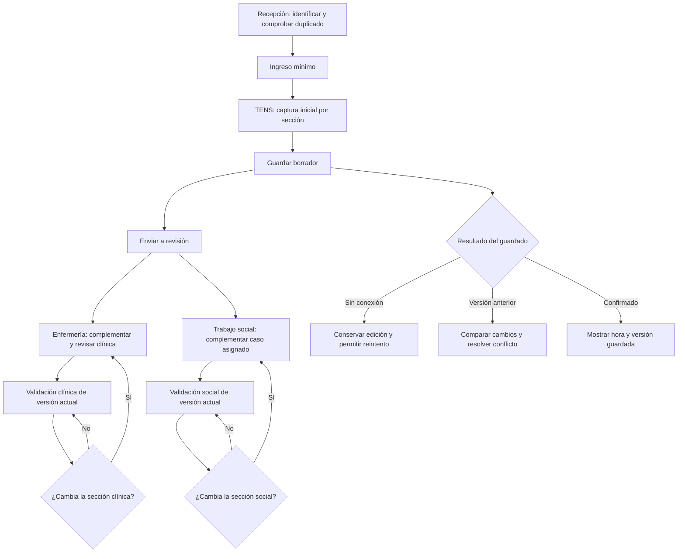

# Preingreso móvil: dirección de UX y checklist

12-09-2026 · Propuesta complementaria a [preingreso-ux.md](preingreso-ux.md). No constituye implementación ni validación de producción. La maqueta de conversación utiliza datos ficticios y conserva cambios sólo en memoria.

## Dirección por rol

| Rol | Trabajo principal | Cierre de su trabajo |
| --- | --- | --- |
| Recepción | Identifica paciente, evita RUT duplicado y completa contacto. | Ingreso mínimo guardado; no declara antecedentes clínicos. |
| TENS | Captura antecedentes mediante botones, detalla cada selección y registra información social inicial. | Guarda borrador o envía cada sección para revisión; no valida. |
| Enfermería | Complementa antecedentes, revisa ambigüedades y confirma la versión clínica. | Valida clínica explícitamente; validación social sólo mediante acción separada. |
| Trabajo social | Complementa convivencia, apoyos y barreras de casos asignados. | Guarda borrador o valida exclusivamente social. |

La maqueta permite cambiar entre TENS, enfermería y trabajo social. El cambio de rol es un control de demostración; en la aplicación el rol procede de la membresía autenticada. Conserva botones y detalle por antecedente, cirugías repetibles, alergias condicionales, apoyo separado de convivencia y exclusión de barreras. Permite simular guardado, fallo de conexión y conflicto. Su resolución de conflicto es un ejemplo resumido, no una comparación completa de datos.

## Maqueta de estados y flujo

Las ramas clínica y social son independientes: la evaluación social pendiente no bloquea atención. La maqueta usa «En preparación» para los borradores de sección y «Por validar» para su envío; los valores de persistencia clínicos continúan definidos en la especificación base. La cola social propuesta requiere ampliar su contrato de estados, sin reutilizar el estado clínico.

## Auditoría y guardado

Cada cambio confirmado debe registrar centro, paciente, sección, versión anterior/nueva, autor autenticado, fecha del servidor, intención, campos modificados y resultado. La validación se vincula a la versión revisada. La revisión previa permanece en el historial cuando pierde vigencia. El historial clínico/social debe respetar el alcance de quien lo consulta; el rol auditor no recibe acceso clínico nuevo por esta propuesta.

No registrar pulsaciones ni datos clínicos en logs generales. Conservar las diferencias sensibles sólo en el historial protegido. La escritura y su evento deben ser atómicos o recuperables mediante un evento durable. Guardar sólo campos explícitos; omisiones preservan información. Versionar por sección y rechazar sobrescrituras concurrentes. Reintentar una operación confirmada no debe duplicarla. El sello social y el clínico nunca se actualizan juntos por un guardado genérico.

## Checklist para validar la implementación

Todos los ítems están pendientes de ejecución sobre la aplicación implementada. Para cada prueba registrar versión probada, identidad sintética/rol, resultado observado y evidencia. La demostración visual no los acredita.

- [ ] **Móvil:** a 360 px no hay desplazamiento horizontal; campos, teclado y acciones no se superponen; controles de al menos 44 px y texto de entrada legible.
- [ ] **Accesibilidad:** teclado y lector de pantalla identifican selección, etiquetas, errores, campos revelados y resultado de guardado; el color no es la única señal.
- [ ] **Identidad:** RUT con y sin formato encuentra el mismo paciente; dos altas simultáneas no duplican el registro dentro del centro.
- [ ] **Captura TENS:** ingresar antecedentes y enviarlos no produce validación; petición directa de validación también es rechazada por servidor.
- [ ] **Detalle por ítem:** dos procedimientos del mismo tipo conservan lado/año y detalle tras guardar y recargar.
- [ ] **Campos condicionales:** ocultar o desmarcar un detalle con contenido muestra aviso y permite deshacer; no queda publicado contenido oculto como vigente.
- [ ] **Respuestas desconocidas:** vacío, no evaluado y ausencia referida son distintos; no se infieren respuestas negativas.
- [ ] **Alergias:** «Sí presenta» sin agente bloquea envío/validación y enfoca el campo; agente desconocido se registra explícitamente.
- [ ] **Texto libre:** Enter agrega «Otro» sin enviar; texto pendiente no desaparece; duplicados y límites se informan sin truncar.
- [ ] **Social:** vivir solo permite apoyo familiar; «Sin barreras» no coexiste con barreras; las reglas coinciden en todas las vistas y en servidor.
- [ ] **Enfermería:** validar clínica exige revisión explícita; editarla después invalida sólo la revisión clínica vigente.
- [ ] **Trabajo social:** borrador y validación son acciones distintas; un caso no asignado se deniega también por solicitud directa.
- [ ] **Perfiles combinados:** guardar social con permisos TENS/enfermería adicionales preserva antecedentes e identificación omitidos.
- [ ] **Concurrencia:** ediciones simultáneas de la misma sección producen conflicto sin pérdida; secciones distintas conservan ambos cambios.
- [ ] **Errores de red:** el formulario permanece; el reintento es idempotente; éxito de escritura con fallo de refresco se comunica correctamente.
- [ ] **Salida y sesión:** proteger cambios al cambiar paciente/cerrar; reautenticar y revisar permisos sin exponer datos a otra cuenta.
- [ ] **Foto:** vista previa con identidad, cancelación, formato real y máximo 5 MB; fallo conserva foto anterior y formulario; no cambia sellos clínicos/sociales.
- [ ] **Auditoría:** un cambio y una validación generan eventos trazables a su versión; no contienen secretos ni datos clínicos en logs generales.
- [ ] **Aislamiento:** todos los casos se repiten entre dos centros y con roles sin permiso, sin acceso indirecto a datos o fotografías.

## Qué revisar primero

1. TENS selecciona dos antecedentes y agrega detalle; guarda y envía clínica.
2. Enfermería completa y valida; comprobar que social sigue pendiente.
3. Trabajo social completa apoyos/barreras y valida sólo su sección.
4. Simular pérdida de conexión y conflicto; comprobar que nunca aparece un éxito falso.

Prioridad de implementación: contrato de secciones/permisos → guardado y concurrencia → componentes móviles compartidos → foto → pruebas integrales. La maqueta ilustra el flujo principal; foto, protección completa de salida, límites y autorización real se verifican en implementación conforme a la especificación base.
